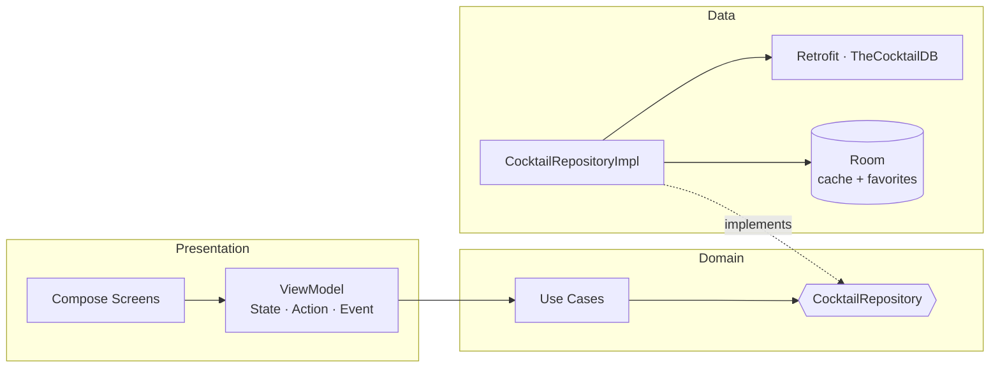

# 🍸 Cocktail Helper

[](https://github.com/BrunoBertolini219/CocktailHelperApp/actions/workflows/android.yml)
[](https://kotlinlang.org)
[](https://developer.android.com/jetpack/compose)
[](https://developer.android.com)

A small Android app for discovering cocktails and mocktails: browse alcoholic and
non-alcoholic drinks, search by name or ingredient, view full recipes, save favorites,
and get a random drink suggestion. Data comes from the free
[TheCocktailDB](https://www.thecocktaildb.com/api.php) API, cached locally for offline use.

> Originally a 2021 learning project (MVVM + Fragments + View Binding), now rebuilt as a
> modern, fully Jetpack Compose, Clean Architecture + MVI showcase.

<a href="https://play.google.com/store/apps/details?id=br.com.brunoccbertolini.cocktailhelperapp">
  
</a>

---

## ✨ Features

- **Browse** alcoholic & non-alcoholic drinks in a responsive adaptive grid
- **Search** by name or ingredient with debounced input
- **Recipe details** — ingredients, measures, glass, category and instructions
- **Favorites** with swipe-to-dismiss, persisted locally
- **Random drink** suggestion
- **Offline-first** — drink lists are cached in Room and served instantly, then refreshed
- **Material 3** with dynamic color (Android 12+), full **light & dark** themes
- **Edge-to-edge** UI that adapts between a bottom `NavigationBar` (phones) and a
  `NavigationRail` (tablets/foldables)
- **Localized** error & status messages (no hardcoded strings in the data layer)

## 📸 Screenshots

<!-- Add light + dark captures to docs/screenshots/ and reference them here, e.g.:
| List | Detail | Search | Dark |
| --- | --- | --- | --- |
|  |  |  |  |
-->
_Screenshots coming soon — drop light/dark captures into `docs/screenshots/`._

## 🏗️ Architecture

Clean Architecture with a unidirectional **MVI** presentation layer. Dependencies point
inward: `presentation → domain ← data`.



- **domain** — framework-free models, `CocktailRepository` interface, and one use case per action.
- **data** — Retrofit `CocktailApi`, Room (`CocktailDao`, cache + favorites entities), DTOs,
  mappers, and the repository implementation. Network results are wrapped in a typed
  `Resource`/`DataError` — **never** user-facing strings.
- **presentation** — MVI `ViewModel`s expose immutable `State` + one-shot `Event`s; screens
  split into a stateful root and a stateless content composable. Errors map to localized
  `UiText` only at the Compose boundary. UI is built from an atomic design system
  (`design/atoms`, `design/molecules`, `design/organisms`) with `@PreviewLightDark` previews.

## 🧰 Tech stack

| Area | Choice |
| --- | --- |
| Language | Kotlin 2.1.10 (KSP) |
| UI | Jetpack Compose (BOM 2025.05.01), Material 3, WindowSizeClass |
| Architecture | Clean Architecture + MVI, type-safe Navigation Compose |
| DI | Hilt |
| Networking | Retrofit + OkHttp + kotlinx.serialization |
| Persistence | Room (offline-first cache + favorites) |
| Images | Coil 3 |
| Async | Coroutines + Flow |
| Observability | Firebase Crashlytics & Analytics, Timber |
| Testing | JUnit4, Turbine, Truth, coroutines-test |
| Build | Gradle 8.13 / AGP 8.9, version catalog, R8 |

## 🚀 Getting started

**Prerequisites:** Android Studio (Ladybug+) and JDK 17.

```bash
git clone https://github.com/BrunoBertolini219/CocktailHelperApp.git
cd CocktailHelperApp
./gradlew assembleDebug
```

Then open the project in Android Studio and run the `app` configuration, or install via:

```bash
./gradlew installDebug
```

> A `google-services.json` is included for Firebase. TheCocktailDB is used with its public
> test key (`1`); no secrets are required to build or run.

## ✅ Quality

```bash
./gradlew testDebugUnitTest   # unit tests (ViewModels, repository fakes, mappers)
./gradlew lintDebug           # Android Lint
./gradlew assembleRelease     # R8 / minified release build
```

CI (GitHub Actions) runs the debug build, unit tests, and lint on every push and pull request.

## 🙏 Credits

- Drink data & images: [TheCocktailDB](https://www.thecocktaildb.com/)

## 📄 License

Personal portfolio project by [Bruno Bertolini](https://github.com/BrunoBertolini219).
